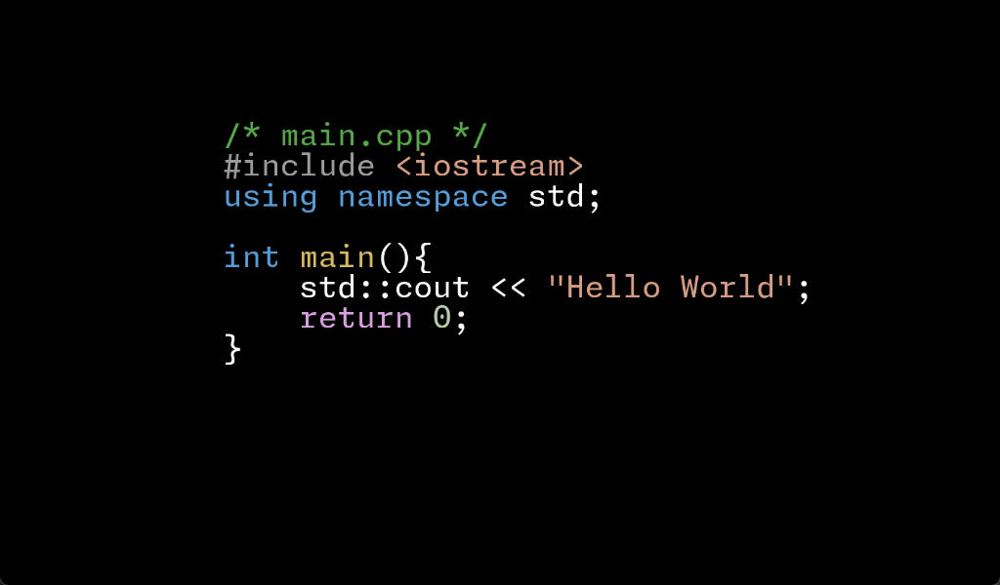
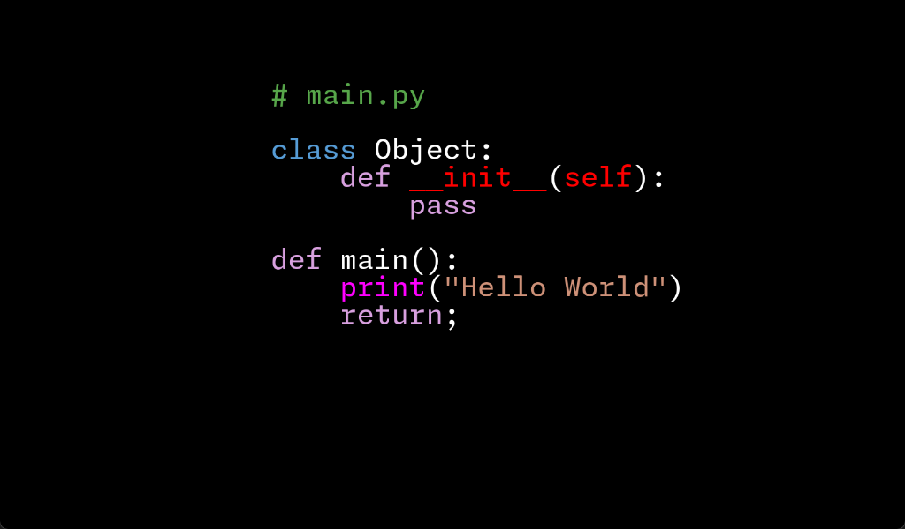
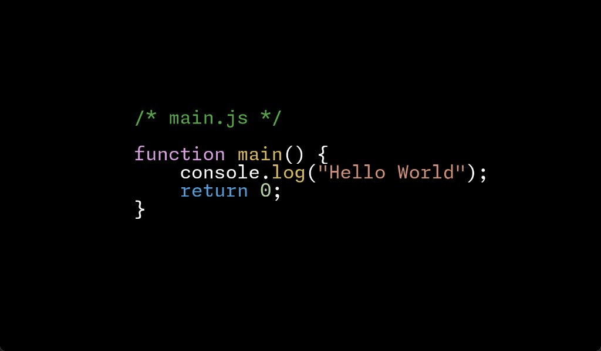

# Editor
---

Lightweight code editor for C++, Python, Javascript.  
Inspired by [DED](https://github.com/tsoding/ded/tree/master) 

## How to build in Windows(x86)

```
mkdir build && cd build
cmake .. -A Win32
```

Then open Editor.sln in /build.

## How to use

Just drag & drop your source file to Editor.exe.

## Features

- VS-like syntax highlighting for C++, Python, Javascript. *
- Keyboard shortcut bindings(Ctrl + S, Ctrl + A, Ctrl + X, Ctrl + C, Ctrl + V)
- Word selection using Shift + Arrow keys
- Background rendering **
- Toggling Rainbow mode using F1
- Toggling Fullscreen mode using F11
- Notifier for modified file ***

> \* You can change target language by modifying `include/macros.h` (default : C++)  
> \** You can set background by defining `BACKGROUND_TARGET_PATH` in `include/macros.h` (default : undefined)  
> \*** This feature is only for existing file

## Screenshot
|   |  |
| ------------- | ------------- |
|   |  |

## Thirdparty Libraries

- GLFW - Zlib License
- GLAD - MIT License
- stb - CC0 License
- FreeType - FreeType License


## Warning

- This application might be unstable for huge file.

2024.02.21 - 2024.02.26.  
MIT Licensed.
